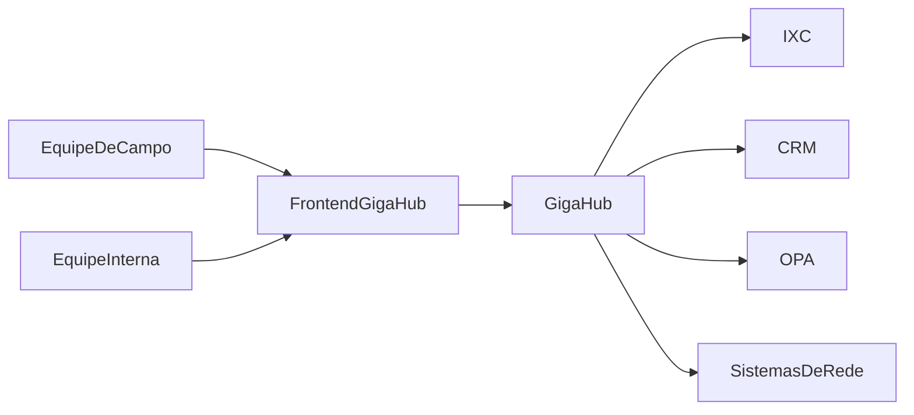
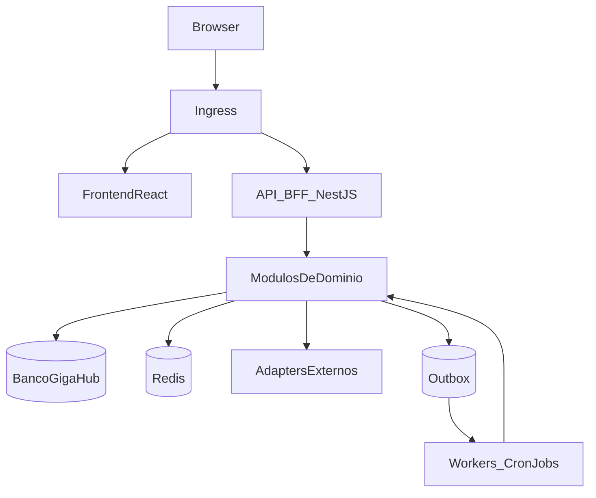
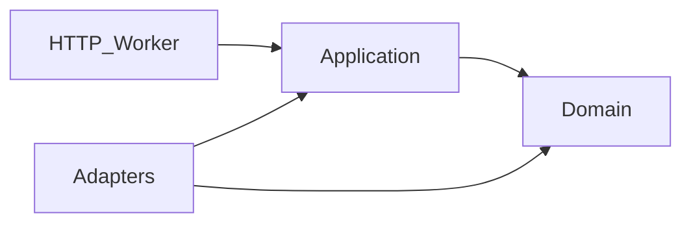

# 02 — Arquitetura

## Decisão principal

O GigaHub começa como **monólito modular** em um monorepo Nx. Módulos têm limites,
contratos e ownership claros, mas podem compartilhar um processo e uma entrega no
início. Workers e componentes com perfil operacional diferente podem ser separados
antes dos serviços de domínio.

Microserviços são uma consequência de necessidades comprovadas de escala, isolamento,
segurança ou ciclo de entrega — não um objetivo isolado.

## Contexto

## Containers lógicos

Containers iniciais:

- `apps/web`: frontend React unificado.
- `apps/api`: HTTP, BFF, autenticação e composição dos módulos.
- `apps/worker`: consumidores e tarefas assíncronas de longa duração.
- `libs/shared/kernel`: IDs, ponto geográfico e erros de domínio, sem framework.
- `libs/domain/customer`: entidade Cliente (Customer Care).
- `libs/domain/work-order`: entidade Ordem de Serviço, assuntos e políticas de campo.
- `libs/domain/care-inbox`: caixa de atendimento e tickets (OPA/CRM).
- `libs/shared/contracts`: DTOs HTTP e eventos versionados, sem lógica de domínio.
- `libs/application-*`: casos de uso, portas e eventos (a introduzir por módulo).
- `libs/adapters-*`: IXC, bancos, Redis, CRM, demais integrações.
- `libs/observability`: logging, métricas e tracing padronizados.
- `deploy`: artefatos de implantação por ambiente.

Domínio não depende de NestJS, Mongoose ou HTTP. Frontend e API compartilham
contratos; a API também usa as entidades de domínio. Novos módulos seguem o
mesmo recorte. A migração pode ocorrer gradualmente sem mover todo o código
de uma vez.

## Dependências permitidas

- Domínio não importa NestJS, Mongoose, TypeORM, Socket.IO ou SDKs externos.
- Aplicação depende do domínio e declara portas.
- Adapters implementam portas e podem depender de frameworks.
- Entradas convertem transporte em comandos, executam casos de uso e traduzem erros.
- Um módulo não consulta tabelas/coleções privadas de outro; usa contrato explícito.

Regras inicialmente aplicadas por lint e revisão podem evoluir para tags do Nx.

## Módulos

### Identity & Access

Usuários, credenciais, sessões, autenticação, grants e trilha de acesso.

### Field Work

Agenda, deslocamento, execução, evidências, perguntas, revisão e finalização de OS.
É o domínio mais acoplado ao IXC e deve ser um dos últimos a ser extraído.

### Network

CTO, sinais, elementos, fibra, relatórios e provisionamento de ONU.

### Inventory

Estoque do técnico, requisição, transferência, movimentação e produtos da OS.

### Finance Ops

Fechamento, transferência, recebimento, vistoria e depreciação operacional.

### Customer Care

Consulta de cliente, conectividade, suporte, OPA e tickets CRM.

### Messaging

WhatsApp e notificações. Canais são adapters; mensagens agendadas ou repetíveis
devem passar por worker.

### Telemetry

Ingestão de GPS, localização atual, histórico, presença e stream em tempo real.

### Automation

Agenda e execução de sincronizações e tarefas. Não contém regras privadas dos outros
módulos: chama casos de uso públicos.

### Gamification

Consome fatos verificáveis, aplica regras versionadas e registra lançamentos. Não pode
alterar o resultado do caso de uso que originou o evento.

## Comunicação

### Dentro do processo

Casos de uso são chamados diretamente por interfaces TypeScript. Eventos internos
podem desacoplar efeitos secundários, mas não devem esconder consistência obrigatória.

### Entre processos

- HTTP/OpenAPI para operações síncronas.
- Eventos versionados para fatos assíncronos.
- Socket.IO apenas entre backend e clientes que precisam de atualização em tempo real.
- Outbox transacional para publicar eventos que não podem ser perdidos.

O broker ainda não está decidido. O contrato do evento deve ser independente de
RabbitMQ, NATS ou Kafka.

### Idempotência

Comandos vindos de webhooks, workers e integrações devem aceitar uma chave de
idempotência quando houver risco de repetição. Consumidores persistem a identidade do
evento processado. Retry nunca pode duplicar movimentação financeira, estoque,
provisionamento ou pontos.

## Dados

- IXC permanece fonte operacional para responsabilidades do ERP.
- O GigaHub mantém seus próprios dados de identidade, configuração, auditoria,
  gamificação e projeções.
- Cada módulo é dono lógico do seu schema/coleções, mesmo em uma instância compartilhada.
- Redis contém somente dados efêmeros ou reconstruíveis.
- Arquivos são acessados por uma porta de storage, permitindo migrar de volume
  compartilhado para object storage.
- Leituras do IXC passam por uma camada anticorrupção que traduz nomes e modelos
  legados para conceitos do GigaHub.

## API e versionamento

- Prefixo público sugerido: `/api/v1`.
- OpenAPI publicado e validado em CI.
- Mudanças compatíveis podem evoluir na mesma versão.
- Mudanças incompatíveis exigem nova versão ou período de compatibilidade.
- Erros seguem envelope comum com `code`, `message`, `details` e `traceId`.
- Eventos têm `eventId`, `eventType`, `eventVersion`, `occurredAt`, `actor` e payload.

## Consistência e falhas

- Operações no mesmo banco usam transação quando necessário.
- Integrações externas usam timeout, retry com backoff e circuit breaker seletivo.
- Retry depende de idempotência; sem ela, a falha deve ir para intervenção segura.
- Efeitos secundários não críticos, como pontos e notificações, não bloqueiam a ação
  principal e podem ser recuperados pela outbox.
- Estados parciais relevantes ficam visíveis em auditoria e métricas.

## Critérios para extrair um serviço

Extrair somente quando um ou mais sinais forem comprovados:

- necessidade de escalar independentemente;
- carga ou runtime incompatível, como Chromium;
- falha do componente afeta jornadas não relacionadas;
- exigência de isolamento de dados ou segurança;
- equipe e ciclo de entrega independentes;
- fronteira estável, observável e coberta por testes;
- benefício superior ao custo de rede, deploy e consistência distribuída.

Primeiros candidatos: Telemetry, workers.
Work/OS permanece no núcleo até seus contratos estarem estabilizados.

## Observabilidade

Toda entrada recebe ou cria `traceId`. Logs estruturados incluem módulo, operação,
resultado e duração, sem expor secrets ou dados pessoais desnecessários. Métricas
medem tráfego, latência, erros, filas, retries e integrações. Tracing cobre chamadas
externas e processamento assíncrono.

## Segurança arquitetural

- autenticação central e autorização em cada operação;
- validação de payload nas bordas;
- service accounts para processos, não credenciais humanas;
- secrets por ambiente e rotação possível;
- menor privilégio para bancos e integrações;
- auditoria append-only para ações sensíveis;
- nenhuma decisão de acesso baseada apenas em esconder navegação no frontend.

## Decisões relacionadas

Consulte os [ADRs](./adr/README.md) para motivação, consequências e gatilhos de revisão.
