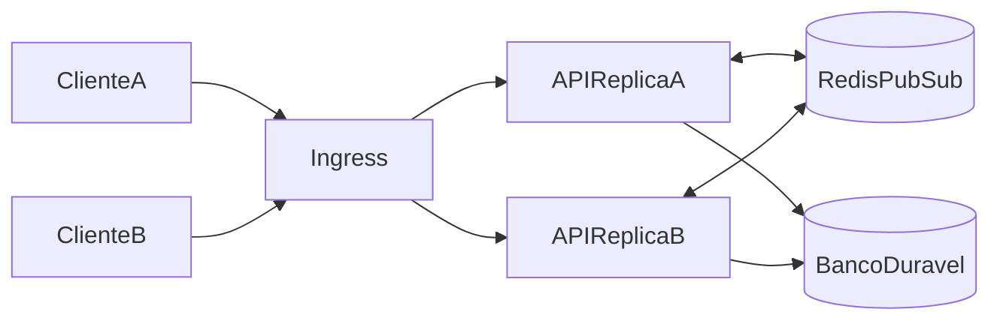

# 04 — Tempo real e Redis

## Objetivo

Usar Socket.IO para experiências interativas que precisam de baixa latência e Redis
para coordenar réplicas, sem transformar nenhum dos dois na fonte exclusiva de dados
de negócio.

## Quando usar Socket.IO

Usar para:

- localização e presença ao vivo;
- atualização de estado que precisa aparecer em segundos;
- progresso de processos longos;
- notificações interativas.

Preferir HTTP para comandos, consultas paginadas, upload e sincronização inicial. O
cliente sempre obtém um snapshot por HTTP antes de aplicar eventos incrementais.

## Topologia



O adapter Redis do Socket.IO distribui broadcasts entre réplicas. Sessões de
transporte podem exigir afinidade no Ingress quando long-polling estiver habilitado.
Se todos os clientes e a infraestrutura suportarem WebSocket, desabilitar fallback
pode remover essa necessidade; a decisão deve ser testada no ambiente real.

## Conexão e autenticação

1. Cliente obtém access token por HTTP.
2. Abre conexão enviando o token no handshake.
3. Servidor valida assinatura, expiração, audience e sessão.
4. Servidor calcula salas autorizadas; o cliente não escolhe salas privilegiadas.
5. Renovação do token reconecta ou executa protocolo explícito de reautenticação.
6. Revogação de sessão encerra conexões associadas ao `sid`.

Não enviar token em query string, pois URLs aparecem em logs. CORS e origins são
restritos por ambiente.

## Namespaces iniciais

- `/telemetry`: GPS, presença e acompanhamento ao vivo.
- `/notifications`: notificações destinadas ao usuário/equipe.
- `/operations`: progresso de jobs e atualizações operacionais autorizadas.

Criar namespace somente quando houver isolamento real de middleware, audiência ou
volume. Eventos carregam envelope comum:

```json
{
  "eventId": "uuid",
  "eventType": "telemetry.location.updated",
  "eventVersion": 1,
  "occurredAt": "2026-08-07T20:00:00Z",
  "data": {}
}
```

## Salas e autorização

Salas são derivadas no servidor, por exemplo:

- `user:{userId}`;
- `team:{teamId}`;
- `operation:{operationId}`;
- `tracking:{employeeId}` para supervisores autorizados.

Ingressar em uma sala exige autorização no momento da inscrição. Mudanças de grant
removem conexões ou forçam revalidação. Nomes internos não substituem autorização.

## GPS

Fluxo recomendado:

1. Dispositivo envia localização por HTTP autenticado ou evento com ack.
2. Backend valida usuário, precisão, idade, coordenadas e rate limit.
3. Localização aceita é persistida conforme política de retenção.
4. Backend atualiza a projeção efêmera da última posição no Redis.
5. Evento é publicado somente para salas autorizadas.

O histórico durável não depende do Redis. Atualizações podem ser coalescidas para
reduzir escrita e broadcast, sem violar as regras de localização recente. Dados de
GPS são pessoais e devem ter retenção, acesso e auditoria específicos.

## Responsabilidades do Redis

Uso inicial:

- Socket.IO pub/sub;
- cache de consultas reconstruíveis;
- última posição/presença com TTL;
- rate limits distribuídos;
- locks curtos para coordenação;
- deduplicação temporária;
- projeções de ranking quando forem habilitadas;
- aceleração de checagem de sessão/revogação.

Não armazenar apenas no Redis:

- usuários, grants ou credenciais;
- histórico obrigatório de localização;
- auditoria;
- movimentações financeiras e de estoque;
- ledger de gamificação;
- estado definitivo de OS;
- eventos que não podem ser perdidos.

## Convenções de chaves

Formato sugerido:

```text
gigahub:{env}:{module}:{purpose}:{id}
```

Toda chave de cache ou presença possui TTL. O valor contém versão de schema quando não
for trivial. Chaves não incluem e-mail, CPF, nome ou outro dado pessoal legível.

## Cache

- Cache-aside para leituras caras e tolerantes a dado temporariamente antigo.
- TTL com jitter evita expiração simultânea.
- Invalidação ocorre por evento ou escrita do caso de uso.
- Cache miss nunca altera a regra de negócio.
- Métricas distinguem hit, miss, erro e latência.
- Evitar cache de autorização sem versão ou limite curto.

## Locks

Lock distribuído só coordena concorrência; não substitui constraint, transação ou
idempotência no banco. Locks têm TTL, token de ownership e operação segura de release.
Processos longos precisam renovação controlada ou outra estratégia de exclusão.

## Rate limit

Limites consideram endpoint/evento, usuário, service account e origem. Rotas de login,
GPS e eventos de alta frequência têm políticas próprias. Respostas informam retry
quando seguro. Queda do Redis segue política explícita:

- autenticação e ações sensíveis: falhar de forma segura ou aplicar limite local curto;
- leitura de cache: ignorar cache;
- presença/ranking: degradar sem bloquear operação;
- GPS: persistir quando possível e suspender apenas o broadcast.

## Entrega e ordenação

Socket.IO oferece conexão, não processamento exactly-once. Clientes devem tolerar
evento repetido, atrasado ou perdido:

- deduplicar por `eventId`;
- usar `occurredAt` e versão/revisão para ordenar quando necessário;
- refazer snapshot após reconexão;
- não usar broadcast como confirmação de comando;
- exigir ack somente quando ele tiver efeito operacional claro.

## Escalabilidade

Medir conexões, mensagens por segundo, tamanho de payload, lag do event loop, uso do
Redis e frequência de reconexão. HPA baseado apenas em CPU pode não refletir conexões;
usar métricas adequadas e drenagem de conexões no shutdown.

Redis em produção precisa de autenticação, TLS quando disponível, política de memória,
monitoramento, backup apenas para usos que justifiquem e estratégia de alta
disponibilidade compatível com o ambiente.

## Testes essenciais

- duas ou mais réplicas trocando eventos pelo adapter Redis;
- conexão recusada com token inválido, expirado ou revogado;
- usuário impedido de assinar sala sem grant;
- reconexão seguida de snapshot correto;
- indisponibilidade e recuperação do Redis;
- evento duplicado e fora de ordem;
- rollout com drenagem de conexões;
- rate limit distribuído;
- ausência de perda do registro durável de GPS.
