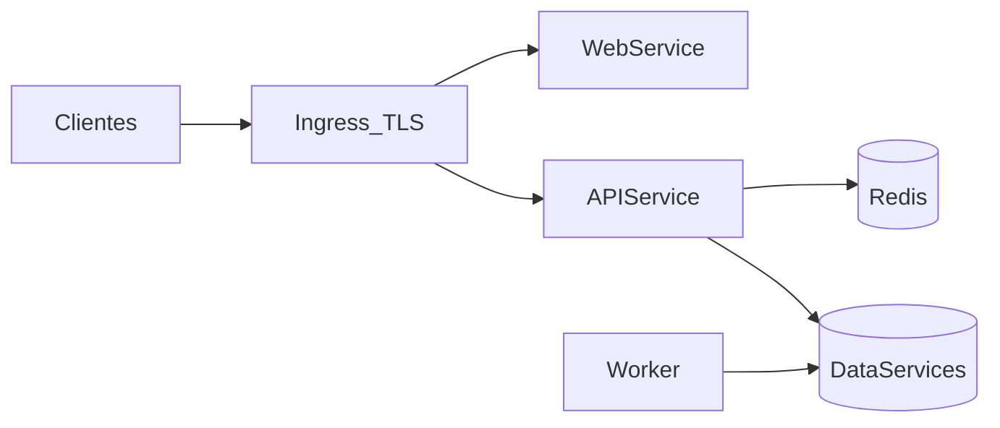

# 05 — Kubernetes e operação

## Objetivo

Preparar o GigaHub para implantação repetível, segura e observável em Kubernetes sem
obrigar que todo componente de dados rode dentro do cluster.

## Princípios

- Imagens imutáveis e executáveis como usuário não-root.
- Processos stateless sempre que possível.
- Configuração e secrets injetados por ambiente.
- Probes representam estados diferentes e têm baixo custo.
- Jobs são idempotentes e observáveis.
- Banco, Redis e broker são dependências substituíveis por serviço gerenciado.
- Infraestrutura é declarativa, revisável e promovida entre ambientes.

## Workloads

### Deployments

- `gigahub-web`: assets do frontend servidos por CDN ou servidor estático.
- `gigahub-api`: HTTP, BFF e Socket.IO.
- `gigahub-worker`: consumidores contínuos.

Cada workload possui ServiceAccount, recursos, probes, política de rollout e acesso
mínimo às dependências.

### CronJobs

Candidatos:

- sincronização de usuários, fibra e nomes OPA;
- provisionamento e higiene de ONU;
- notificações financeiras;
- reconciliações e limpeza segura.

Usar `concurrencyPolicy: Forbid` apenas quando a sobreposição for realmente inválida;
ainda assim, o job deve ser idempotente. Configurar deadline, histórico limitado,
retry e alerta de atraso/falha.

## Ambientes

- `dev`: desenvolvimento e integração rápida; dados não produtivos.
- `staging`: topologia e políticas próximas de produção.
- `prod`: controles de acesso, disponibilidade, backup e alertas completos.

A mesma imagem é promovida entre ambientes. Diferenças ficam em valores e secrets,
não em branches ou builds especiais.

## Rede e entrada

- TLS termina no Ingress ou gateway aprovado.
- Rotas `/api` e `/socket.io` apontam para API.
- Origins, limites de payload e timeouts são definidos por rota.
- Socket.IO deve ser testado com o controller de Ingress escolhido.
- NetworkPolicies limitam comunicação entre workloads e dependências.
- Serviços internos não são publicados externamente sem necessidade.

## Configuração e secrets

ConfigMaps contêm valores não sensíveis. Secrets vêm de um secret manager por
External Secrets ou mecanismo equivalente. Nenhum secret entra em Dockerfile, Git,
log ou bundle do frontend.

Cada valor tem:

- nome e descrição;
- owner;
- ambiente;
- obrigatoriedade e valor padrão seguro;
- política de rotação quando sensível.

Mudanças de configuração que exigem restart devem provocar rollout controlado.

## Probes

- **Startup**: permite inicialização lenta sem reinícios prematuros.
- **Liveness**: detecta processo travado; não depende de todos os sistemas externos.
- **Readiness**: remove a réplica do tráfego quando não pode atender corretamente.

Uma falha do IXC não deve necessariamente reiniciar a API. Health detalhado para
operação pode mostrar dependências sem transformar todas em liveness.

## Recursos e escala

Todo container define requests e limits iniciais baseados em teste, depois ajustados
por métricas. HPA considera CPU/memória e, quando útil, tráfego, conexões Socket.IO ou
lag de fila.

- API escala horizontalmente com Redis adapter e sem estado local obrigatório.
- Workers escalam por lag e throughput, respeitando concorrência das integrações.
- PDF possui recursos e fila próprios.
- CronJobs não são escalados como API.
- PodDisruptionBudget é usado somente onde réplicas e disponibilidade justificam.

Vertical Pod Autoscaler pode recomendar recursos; mudanças automáticas precisam ser
avaliadas por workload.

## Shutdown e rollout

Ao receber `SIGTERM`, o processo:

1. marca readiness como indisponível;
2. para de aceitar novos trabalhos;
3. drena HTTP e Socket.IO dentro do prazo;
4. conclui ou devolve mensagens não confirmadas;
5. fecha conexões;
6. encerra antes de `terminationGracePeriodSeconds`.

Rollouts usam readiness e estratégia gradual. Migrações de banco seguem
expand/contract para manter compatibilidade entre versões durante o deploy.

## Dados

### Redis

Pode ser chart/operator ou serviço gerenciado. Produção exige autenticação, política
de memória, alta disponibilidade coerente com o uso e métricas.

### Banco do GigaHub

Pode iniciar em Mongo para continuidade, mas ownership lógico por módulo e migrations
precisam ser explícitos. A escolha de banco gerenciado versus cluster deve considerar
backup, restore testado, upgrades e capacidade operacional.

### IXC e OPA

São dependências externas. Acesso usa credenciais mínimas, timeout e pools limitados.
Não assumir que estão na mesma rede ou têm disponibilidade de serviço cloud.

### Arquivos

Código depende de interface de storage. PVC/NFS pode preservar compatibilidade
inicial; object storage é preferível para novos arquivos quando o fluxo permitir.

## Observabilidade

### Logs

JSON em stdout com timestamp, nível, serviço, versão, ambiente, módulo, `traceId` e
resultado. Não registrar tokens, senhas, payloads completos de localização ou dados
pessoais sem necessidade.

### Métricas

- RED para APIs: rate, errors, duration.
- USE para recursos: utilization, saturation, errors.
- conexões e eventos Socket.IO;
- hit/miss e erros Redis;
- fila, retry, dead letter e idade da mensagem;
- duração, atraso e falha de CronJobs;
- disponibilidade e latência por integração;
- indicadores das jornadas críticas.

### Tracing

Propagar contexto por HTTP e eventos. Spans externos incluem sistema e operação, sem
credenciais. Sampling preserva erros e fluxos críticos.

### Alertas

Alertas devem indicar impacto e ação, não apenas uso de recurso. Definir owner e
runbook. Exemplos: falha contínua de login, backlog de mensagens, sync atrasado,
indisponibilidade do IXC, rejeição anormal de GPS e erro no outbox.

## CI/CD e GitOps

Pipeline mínimo:

1. lint, typecheck e testes;
2. validação OpenAPI, docs e boundaries;
3. build reproduzível;
4. SBOM e scan de dependências/imagem;
5. assinatura e publicação no registry;
6. deploy em ambiente de validação;
7. smoke tests;
8. promoção declarativa.

Argo CD ou Flux aplica o estado desejado. A ferramenta será decidida por ADR quando a
infraestrutura existir. Deploy de produção deve ser rastreável até commit e imagem.

## Segurança

- Pod Security Standards restritivos.
- Imagem com base mínima, filesystem read-only quando possível e capabilities removidas.
- RBAC Kubernetes por workload e pessoa.
- Secrets rotacionáveis e criptografados.
- NetworkPolicies e egress controlado.
- Scan e correção por severidade/SLA.
- Logs de auditoria do cluster e das mudanças GitOps.

## Continuidade

- Objetivos de recuperação definidos por dado e jornada.
- Backups automatizados e restore testado.
- Outbox, jobs e consumidores reconciliáveis.
- Runbooks para Redis, banco, IXC, filas e rollbacks.
- Staging exercita migrações e recuperação antes de produção.

## Checklist de prontidão

- [ ] Imagens não-root, imutáveis e escaneadas.
- [ ] Configuração e secrets externos.
- [ ] Startup, liveness e readiness validados.
- [ ] Requests, limits e shutdown gracioso.
- [ ] API escalando com Socket.IO em múltiplas réplicas.
- [ ] Jobs idempotentes e sem execução duplicada perigosa.
- [ ] Logs, métricas, traces, dashboards e alertas.
- [ ] Backup e restore testados.
- [ ] Deploy rastreável e rollback praticado.
- [ ] Runbooks com owners.
