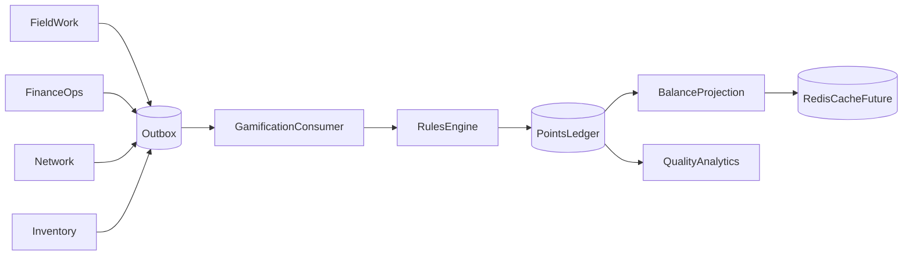

# 07 — Gamificação

## Objetivo

Reconhecer comportamentos que aumentam qualidade, conformidade e colaboração. A
primeira fase apenas registra e analisa pontos; não exibe saldo aos colaboradores e
não afeta remuneração, punição ou avaliação formal.

Gamificação é um mecanismo de feedback, não uma fonte de verdade sobre desempenho.

## Princípios

1. **Qualidade antes de volume**: quantidade isolada não representa trabalho correto.
2. **Explicável**: todo ponto possui regra, origem e motivo.
3. **Auditável**: lançamentos não são editados; correções geram estorno/ajuste.
4. **Idempotente**: o mesmo fato não pontua duas vezes.
5. **Reversível**: retrabalho ou cancelamento podem estornar um crédito.
6. **Não bloqueante**: falha na gamificação não falha a operação principal.
7. **Privacidade progressiva**: visibilidade cresce somente após revisão.
8. **Configuração segura**: regras versionadas e aprovadas antes de entrar em vigor.

## Arquitetura



Os domínios publicam fatos operacionais. Gamification decide se o fato pontua. O
domínio de origem não conhece valores de pontos.

## Eventos candidatos

Exemplos para estudo, não catálogo aprovado:

- `fieldwork.order.completed`;
- `fieldwork.order.review.approved`;
- `fieldwork.evidence.completed`;
- `inventory.transfer.confirmed`;
- `finance.cashbox.inspection.approved`;
- `network.onu.provisioning.completed`;
- `customer.support.resolved`;
- `fieldwork.order.rework.requested`;
- `fieldwork.order.cancelled`.

Eventos precisam representar resultado verificável. “Abriu uma tela”, “ficou online”
ou “enviou muitas ações” não são evidência suficiente de qualidade.

## Regra de pontos

Uma regra contém:

- `ruleId` e versão imutável;
- nome e descrição em linguagem humana;
- tipo e versão do evento aceito;
- condições;
- pontos;
- momento de confirmação;
- limites por período;
- política de estorno;
- vigência;
- owner e aprovação;
- status `draft`, `active`, `paused` ou `retired`.

Alterar pontos ou condições cria nova versão. Eventos históricos permanecem ligados à
versão aplicada.

Exemplo conceitual:

```json
{
  "ruleId": "fieldwork-order-approved",
  "version": 1,
  "eventType": "fieldwork.order.review.approved",
  "points": 10,
  "dailyCap": 80,
  "effectiveFrom": "2026-09-01T00:00:00Z"
}
```

## Ledger

O ledger é append-only. Cada lançamento contém:

- `entryId`;
- `employeeId`;
- `amount`;
- `entryType`: `credit`, `debit`, `reversal` ou `manual_adjustment`;
- `ruleId` e `ruleVersion`, quando automático;
- `sourceEventId` e `sourceEventType`;
- `idempotencyKey`;
- motivo legível;
- ator do ajuste;
- referência ao lançamento estornado;
- `occurredAt`, `recordedAt` e `traceId`;
- metadados mínimos necessários.

Constraint única sobre a chave de idempotência impede pontuação duplicada. Saldo é a
soma/projeção do ledger e pode ser reconstruído. Nunca atualizar um campo `points` sem
preservar o lançamento que produziu a mudança.

## Estados pendentes e confirmação

Algumas ações só demonstram qualidade depois de revisão. Nesses casos:

1. evento inicial cria pontuação pendente ou não cria lançamento;
2. aprovação confirma o crédito;
3. rejeição não credita;
4. retrabalho posterior pode gerar estorno ligado ao crédito original.

O momento exato precisa ser definido por regra. Pontuar “OS executada” e novamente
“OS aprovada” pode duplicar reconhecimento se as regras não forem complementares.

## Ajustes manuais

Supervisores com `gamification:adjust` podem creditar, debitar ou estornar somente com:

- valor dentro do limite permitido;
- justificativa obrigatória;
- referência a colaborador e período;
- autenticação recente para ações sensíveis;
- auditoria do ator;
- aprovação adicional acima de um limite futuro.

Débitos e estornos corrigem créditos indevidos ou cancelados; não são punições por
desempenho. Um comportamento que deixa de merecer crédito deve, por padrão, não gerar
o crédito ou estornar a regra relacionada, mantendo a explicação objetiva.

O lançamento original não é alterado. Ajuste não pode mascarar erro de regra: falhas
sistêmicas exigem correção, pausa e reconciliação.

## Prevenção de incentivos ruins

Antes de ativar uma regra, revisar:

- pode ser maximizada reduzindo qualidade?
- favorece função, região, turno ou tipo de OS sem intenção?
- depende de oportunidade que o colaborador não controla?
- incentiva esconder erros ou evitar trabalhos difíceis?
- duplica outra regra?
- mede resultado ou apenas atividade?
- permite combinação entre pessoas para gerar pontos?
- possui limite e estorno adequados?

Preferir critérios compostos: conclusão + conformidade + ausência de retrabalho por
janela definida. Não retirar pontos automaticamente por falha de sistema, falta de
material, indisponibilidade do IXC ou fatores fora do controle do colaborador.

## Privacidade e visibilidade

### Fase 1 — registro silencioso

- acesso apenas a TI/produto e responsáveis autorizados;
- objetivo é validar integridade, viés e possibilidade de manipulação;
- nenhum saldo ou ranking para colaboradores;
- sem consequência trabalhista ou financeira.

### Fase 2 — extrato individual

Somente após comunicação clara, permitir que a pessoa veja saldo, lançamentos, regras
e canal de contestação.

### Fase 3 — reconhecimento por equipe

Preferir metas coletivas e contexto comparável. Revisar exposição de nomes e períodos.

### Fase 4 — ranking

Exige aprovação de produto, RH/jurídico quando aplicável, privacidade, regras
estáveis, contestação e evidência de que não prejudica segurança ou qualidade. Redis
pode servir a projeção, mas o ledger durável continua sendo a fonte.

## Contestação e correção

Mesmo antes da exposição, administradores precisam localizar a origem de um ponto.
Quando o extrato individual for liberado, oferecer contestação com prazo, responsável,
status e resposta. Correções geram lançamentos, nunca edição silenciosa.

## Operação

- consumidor usa outbox e retry idempotente;
- falhas permanentes vão para dead letter e alerta;
- replay reconstrói lançamentos ausentes sem duplicar;
- reconciliação compara eventos elegíveis e ledger;
- regras podem ser pausadas sem deploy;
- ativação e alteração geram auditoria;
- métricas não expõem nomes de colaboradores.

## Métricas da própria gamificação

- eventos recebidos, aceitos, ignorados e falhos;
- duplicações bloqueadas;
- lançamentos pendentes e idade;
- estornos e ajustes manuais por regra;
- distribuição por função/equipe/região;
- correlação com retrabalho e conformidade;
- concentração anormal ou variações abruptas;
- contestações quando habilitadas.

Distribuição desigual é sinal para investigação, não prova automática de injustiça ou
mérito.

## Catálogo inicial a definir

Para cada candidato, produto e responsáveis do domínio devem registrar:

1. comportamento desejado;
2. evento confiável que o comprova;
3. fatores fora do controle do colaborador;
4. momento de confirmação;
5. estorno;
6. limite;
7. risco de manipulação;
8. métrica de impacto.

Nenhuma pontuação entra em produção apenas com um valor sugerido neste documento.

## Critérios para sair da fase silenciosa

- pelo menos um período operacional representativo analisado;
- ausência de duplicações não explicadas;
- regras e versões rastreáveis;
- reconciliação funcionando;
- vieses conhecidos documentados e tratados;
- processo de contestação definido;
- comunicação aprovada;
- confirmação de que não haverá uso incompatível com a finalidade declarada.
