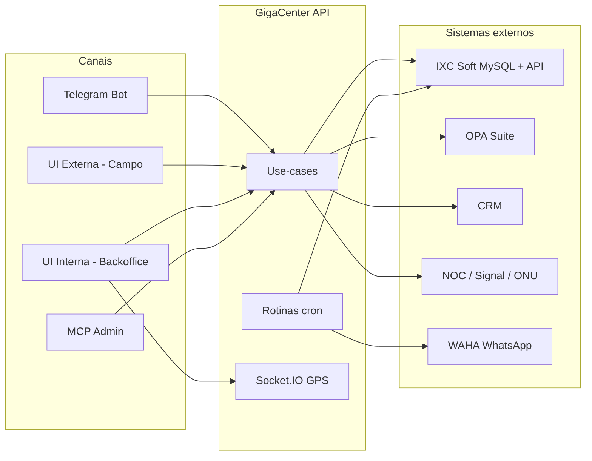

# 01 — Visão geral do GigaCenter

## O que é

O **GigaCenter** é a plataforma de operações internas da **Giganet** (provedor de internet / ISP no Rio Grande do Sul). Ele não substitui o ERP **IXC Soft**: ele é a camada operacional de campo e back-office **em cima** do IXC, com automações, regras de negócio próprias, bot Telegram e interfaces web.

| Identidade | Valor |
|------------|--------|
| Nome de produto (UI) | GigaCenter |
| Pacote npm | `giganet` (`1.0.1`) |
| Imagens Docker | `ghcr.io/typedbywill/gigacenter`, `gigacenter-frontend`, `gigacenter-ui-external` |

## Problema que resolve

Técnicos de campo, supervisores e setores administrativos precisam:

- Executar e documentar **ordens de serviço (OS)** com regras por assunto
- Operar **rede FTTH** (CTO, sinal óptico, autorização de ONU)
- Controlar **estoque** do técnico / almoxarifado
- Fechar e vistoriar **caixas** financeiros
- Ser **monitorados por GPS** em tempo quase real
- Receber e enviar comunicações (Telegram, WhatsApp via WAHA, tickets CRM)

Historicamente o canal principal foi o **Telegram**. A API REST e os apps React reutilizam os **mesmos use-cases**, alinhando HTTP ao comportamento do bot.

## Público e cargos

Não é multi-tenant SaaS: é **uma empresa** (Giganet), com filiais/lojas refletidas no IXC (`id_filial`, lojas).

Acesso interno é por **funcionário** (Mongo `funcionarios`) com **cargo**, por exemplo:

- ADMINISTRATIVO, SUPERVISÃO, SUPORTE, TI, DESENVOLVIMENTO, AUX. DE GERENCIA

A UI interna filtra navegação por cargo; o Mongo também possui coleção `permissoes` para grants mais finos.

## Cobertura geográfica (referência)

Cidades de atuação usadas no sistema (constante `CIDADES` em `apps/api/src/constants.ts`): Sapiranga, Parobé, Igrejinha, Araricá, Nova Hartz, Campo Bom, Dois Irmãos, Taquara, Três Coroas, litoral (Tramandaí, Imbé, Osório, etc.).

## Canais de uso (resumo)

| Canal | Perfil | Função principal |
|-------|--------|------------------|
| Telegram | Técnico / admin | Agenda OS, CTO, estoque, ONU, despesas, config |
| `ui-external` | Técnico (mobile-first) | Mesmo domínio do campo via browser |
| `ui-internal` | Supervisão / financeiro | Caixa, assuntos OS, rastreador GPS |
| MCP (`/api/mcp`) | Ferramentas AI / admin | Consultas cliente/funcionário e SQL controlado |

## Princípio arquitetural atual

**Controllers / Telegram features → Use-cases → Infrastructure adapters**

Isso já é o embrião do GigaHub modular: a regra de negócio vive nos use-cases; Telegram e HTTP são adapters de entrada.

## O que o GigaCenter **não** é (hoje)

- Não é o ERP (IXC continua sendo a fonte de verdade de clientes, OS, contratos, estoque IXC e financeiro ERP)
- Não possui Kubernetes / docker-compose / CI GitHub Actions no repositório
- Não há fila (Rabbit/Kafka) nem Redis — cache é coleção Mongo `cache`
- Não há app nativo mobile separado (o campo usa Telegram + `ui-external`)

## Próximo passo na leitura

→ [02 — Arquitetura](./02-arquitetura.md) para stack e estrutura do monorepo.  
→ [03 — Lógicas de negócio](./03-logicas-de-negocio.md) para o domínio detalhado.
