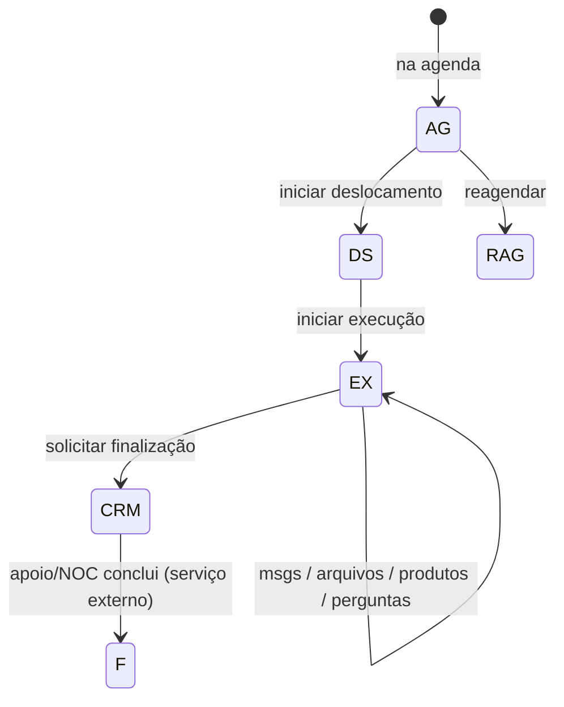
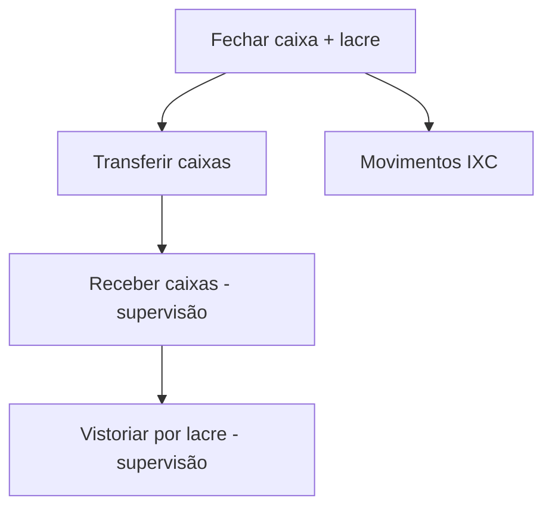

# 03 — Lógicas de negócio

Este documento descreve o **domínio operacional** do GigaCenter: entidades, status, fluxos e regras que o app (e o bot) aplicam. É a peça mais importante para o futuro GigaHub.

## Mapa de domínio

| Domínio | Fonte principal | Onde a regra vive |
|---------|-----------------|-------------------|
| **OS (ordem de serviço)** | IXC `su_oss_chamado` + assuntos Mongo | `use-cases/os`, `revisar-os.service` |
| **Assuntos** | Mongo `assuntos` | Config de fotos, perguntas, validações, `nocRevisa` |
| **Cliente** | IXC `cliente`, contratos, RADIUS | `use-cases/clientes` |
| **CTO / fibra** | IXC `rad_caixa_ftth`, elementos de rede | `use-cases/cto` |
| **ONU** | IXC fibra + serviço de provisionamento | `use-cases/onu` + routines |
| **Estoque** | IXC produtos/movimentos + almoxarifado do funcionário | `use-cases/estoque` |
| **Financeiro (caixa)** | Mongo fechamentos/transferências + movimentos IXC | `api/v1/features/financeiro` |
| **Funcionário / RBAC** | Mongo `funcionarios`, `cargos`, `permissoes` | Auth + sync IXC |
| **Localização** | Mongo `funcionarioLocalizacoes` | Field policies + Socket.IO |
| **Despesas** | API Cristian | `use-cases/despesas` |
| **Suporte / CRM** | CRM HTTP + mapa de assuntos | Finalização OS + auxilio |

---

## 1. Funcionário (identidade operacional)

Coleção Mongo `funcionarios` espelha e estende o colaborador IXC:

| Campo | Uso de negócio |
|-------|----------------|
| `idErp` / `idErpFuncionario` | Vínculo com IXC (usuário / funcionário) |
| `idCaixa` | Caixa financeiro do colaborador |
| `idAlmoxarifado` | Estoque pessoal / técnico |
| `idPlanejamento` | Planejamento IXC |
| `email` / `senha` / `cargo` | Login e RBAC |
| `chatId` / `telegramUsername` | Sessão Telegram |
| `onuPadrao` | Modelo/padrão de ONU preferido na autorização |
| `isLiveLocationActive` | Se o técnico está enviando live location |
| `placaUltimoCarro` | Rastreio / contexto de frota |

**Sync:** rotina `SyncUsersRoutine` (a cada ~5 min) mantém usuários alinhados ao IXC.

---

## 2. Ordens de Serviço (núcleo)

### Status IXC (códigos usados no código)

| Código | Label (`getOsStatus`) | Papel no fluxo de campo |
|--------|------------------------|-------------------------|
| `A` | Aberta | Estado inicial no ERP |
| `AN` | Análise | Triagem |
| `EN` | Encaminhada | Encaminhada a setor/técnico |
| `AS` | Assumida | Assumida |
| `AG` | Agendada | Na agenda do técnico |
| `DS` | Deslocamento | Técnico a caminho |
| `EX` | Execução | Em atendimento no local |
| `F` | Finalizada | Encerrada no ERP |
| `RAG` | Aguardando reagendamento | Reagenda |

### Ciclo de vida no GigaCenter (campo)

#### 2.1 Agenda

- Use-case: `get-minha-agenda`
- Lista OS do técnico para o dia / planejamento

#### 2.2 Deslocamento (`AG` → `DS`)

- Use-case: `iniciar-deslocamento-os`
- API: `POST .../os/:id/deslocamento` (resumo Swagger: status AG → DS)
- Exige políticas de campo (localização fresca, sem bloqueios Telegram)

#### 2.3 Execução (`DS` → `EX`)

- Use-case: `iniciar-execucao-os`
- Entradas obrigatórias:
  - **Tempo estimado** (texto parseado)
  - **Motivo** (≥ 11 caracteres)
  - **Arquivos do assunto** marcados com `solicitaNaExecucao` (quando configurados)
- Efeitos colaterais típicos:
  - Snapshot de clientes da CTO (`osCtoClientesSnapshot`)
  - Integração NetPulse quando o arquivo do assunto exige
  - Status da OS → `EX`

#### 2.4 Atualizações durante a execução

| Ação | Use-case |
|------|----------|
| Mensagem / texto | `add-os-mensagem` |
| Previsão | `update-os-previsao` |
| Perguntas do assunto | `responder-perguntas-os` |
| Upload / listar / remover arquivos | `upload-os-arquivo`, `list-os-arquivos`, `remove-os-arquivo` |
| Adicionar produtos | `adicionar-produto-os` |
| Baixar comodato | `baixar-produto-comodato-os` |
| CTO próxima da OS | `get-os-cto-proxima` |
| Reagendar | `reagendar-os` |

#### 2.5 Revisão e finalização

Fluxo **não** finaliza direto no IXC como `F` no use-case principal: encaminha ao **CRM** para revisão do apoio/NOC.

**Pré-condições (`finalizar-os.use-case`):**

1. Status deve ser `EX`
2. Técnico deve estar a **≤ 300 m** da lat/lng da OS (exceto `ADMIN_CHAT_IDS`)
3. `RevisarOsService` aplica regras do **assunto**:
   - Problemas **bloqueantes** (`podeFinalizar = false`) → HTTP 400
   - Problemas **com aviso** (`podeFinalizar = true`) → HTTP 409 até `confirmarProsseguirComAvisos`
   - Problemas com `informaMotivo` → exige motivo (≥ 5 palavras cada)
4. Cria ticket no CRM com link para serviço de finalização (`/api/services/os/finalizar/:id`)

Mensagem típica ao técnico: OS encaminhada ao CRM; aguardar ok do setor de apoio.

### Assuntos (configurável)

Mongo `assuntos` define o “tipo de OS” operacional:

| Conceito | Significado |
|----------|-------------|
| `idsAssuntos` | IDs de assunto IXC agrupados |
| `nome` | Nome do grupo |
| `tempoPadrao` | Estimativa em minutos |
| `nocRevisa` | Se o NOC/revisão é obrigatória no fluxo |
| `perguntasFinalizacao` | Questionário tipado (string/number/options) com condições |
| `validacoesFinalizacao` | Lista de validações nomeadas |
| `arquivos[]` | Fotos/vídeos exigidos; flag `solicitaNaExecucao` |

Configurável via UI interna (`/os/assuntos`) e Telegram admin.

---

## 3. Políticas de campo (segurança operacional)

Antes de várias ações de OS/CTO:

| Política | Regra |
|----------|-------|
| Localização fresca | Última posição com idade máxima ~**10 minutos** |
| Bloqueios Telegram | Funcionário não pode estar em `telegramBloqueios` |
| Geofence na finalização | ≤ **300 m** do ponto da OS |
| Live location | Bot incentiva/usa live location (`LiveLocationTelegramEvent`) |
| Tracking | Alertas de velocidade (`MAX_SPEED_ALERT: 120`), rate limit ~30s entre updates |

Constantes em `apps/api/src/constants.ts` (`TRACKING_CONFIG`, limiares de sinal óptico `SINAL_MIN/MAX`).

---

## 4. Cliente

Operações de leitura/enriquecimento sobre IXC:

- Detalhes do cliente
- Histórico de sinal óptico
- Senhas Wi-Fi (contexto de OS)
- Verificação de acesso remoto (portas `PORTS_TO_CHECK`: 80, 443)
- CTOs próximas ao endereço do cliente

Também exposto via MCP tool `getCustomerInfo`.

---

## 5. CTO (caixa FTTH) e rede

| Capacidade | Descrição |
|------------|-----------|
| CTO próxima | Do técnico ou do cliente / OS |
| Detalhes + arquivos | Fotos/elementos associados |
| Sinais | Leitura via NOC / signal-reader (+ NetPulse) |
| Relatório PDF | Geração Puppeteer + anexar à OS |
| Elementos de rede | Criação via API `elementos` |

Limiares de sinal de referência: **−25 dBm a −10 dBm**, até 4 tentativas (`MAX_TENTATIVAS_SINAL`).

---

## 6. ONU (provisionamento)

| Fluxo | Detalhe |
|-------|---------|
| Autorizar ONU | Use-case `autorizar-onu` → host `ONU_PROVISIONING_HOST` |
| ONU padrão do técnico | Preferência salva no funcionário |
| Rotina provisionamento | Cron a cada **1 min** — ONUs pendentes |
| ONU desvinculada | Cron a cada **10 min** — higiene de vínculos órfãos |
| Sync fibra | Horário — alinhamento de estoque fibra |

---

## 7. Estoque

| Fluxo | Descrição |
|-------|-----------|
| Meu estoque (PDF) | Relatório do almoxarifado do técnico |
| Requisitar material | Pedido de material |
| Transferência por confirmação | Transferência entre almoxarifados com confirmação |
| Produtos na OS | Adicionar / baixar comodato no contexto do chamado |
| Ensure almoxarifado | Cron ~30 min garante almoxarifado do funcionário |
| Sync fibra | Estoque de fibra alinhado |

---

## 8. Financeiro (caixa)

Domínio da **UI interna** + API `financeiro/*`. Registros app em Mongo (`financeiroFechamento`, `financeiroTransferencia`, `financeiroRecebimentos`) e movimentos no IXC.

| Operação | Quem | Ideia |
|----------|------|-------|
| **Fechamento** | Colaborador com caixa | Informa valores (dinheiro/cartão/cheque/pix/troco), gera **lacre**, grava fechamento |
| **Transferência** | Colaboradores | Move entre caixas |
| **Recebimento** | Supervisão | Confirma recebimento de caixas |
| **Vistoria** | Supervisão | Auditoria por lacre |
| **Depreciação** | Financeiro | Relatório / lançamento de depreciação |
| **Notificar financeiro** | Rotina 08:00 | Alerta diário |
| **Negativar contratos** | Rotina | Existe no módulo (cuidado: impacto financeiro) |
| **PIX inválido (OPA)** | Cron 1 min | Segurança / antifraude sobre Suite |

---

## 9. Despesas

- Lançamento via API `POST /api/v1/despesas/lancar` e conversa Telegram
- Backend externo **Cristian Despesas** (`CRISTIAN_DESPESAS_*`)

---

## 10. Suporte

- `solicitar-auxilio-suporte` — pedido de auxílio
- Finalização de OS cria tickets CRM conforme mapa de assuntos (`CrmAssuntosTicketsMap`)

---

## 11. Monitoramento GPS

1. Técnico envia posição: `POST /api/v1/localizacoes/funcionarios/atual`
2. Persistência em `funcionarioLocalizacoes`
3. Stream ao vivo: Socket.IO namespace `/monitoramento/gps` (path `/api/socket.io`)
4. UI interna: **Rastreador** — agenda ao vivo, status `AG`/`DS`/`EX`, alertas

---

## 12. Auditoria, métricas e Telegram ops

| Coleção / recurso | Uso |
|-------------------|-----|
| `auditoria` | Trilha de auditoria |
| `metricas` | Eventos de métrica (`POST /api/v1/metricas`) |
| `telegramCommandLog` | Log de comandos do bot |
| `telegramBloqueios` | Bloqueio operacional do técnico no bot |

---

## 13. Regras de negócio “implícitas” a preservar no GigaHub

1. **IXC é a verdade** de OS/cliente/estoque ERP; Mongo guarda configuração app, sessão, caixa app e telemetria.
2. **Mesma regra** deve valer em Telegram e HTTP (já centralizada em use-cases).
3. **Assunto** é o motor de compliance da OS (mídia, perguntas, validações, revisão NOC).
4. **Finalizar OS** = pedir aprovação via CRM, não “apertar F” direto no campo.
5. **Campo exige presença física** (GPS fresco + geofence).
6. **Automações** (ONU, WhatsApp, PIX, sync) hoje são crons no mesmo processo — candidatas a workers no K8s.

## Próximo passo

→ [04 — Canais e apps](./04-canais-e-apps.md) para ver como cada interface expõe essas regras.  
→ [06 — Visão GigaHub](./06-visao-gigahub.md) para modularização por domínio.
