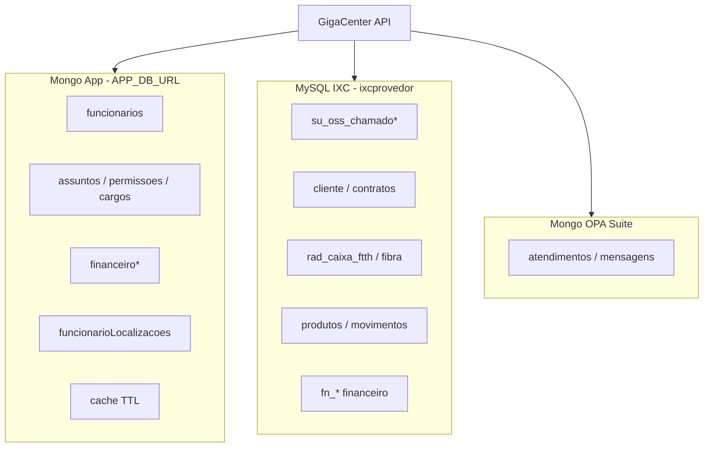

# 05 — Integrações e dados

## Visão de dados

| Store | Tecnologia | Papel |
|-------|------------|-------|
| App DB | MongoDB + Mongoose | Sessão, config, caixa app, GPS, cache, auditoria |
| IXC | MySQL + TypeORM | Fonte de verdade ERP |
| OPA Suite | MongoDB + API | SAC / chats / validações PIX |
| Arquivos | `IXC_FILES_PATH` + `storage/pdfs` | Mídia OS/CTO e PDFs |
| Cache | Coleção Mongo `cache` | KV com TTL (**não** Redis) |
| Filas | — | Inexistentes; crons in-process |

---

## Integrações externas

| Sistema | Config | Papel no negócio |
|---------|--------|------------------|
| **IXC Soft DB** | `IXC_DB_*` | Leitura/escrita SQL controlada |
| **IXC Soft API** | `IXC_API_HOST`, `IXC_API_TOKEN` | Webservice (ex.: atualizar OS) |
| **IXC Files** | `IXC_FILES_PATH` | Arquivos de OS/CTO em disco/rede |
| **OPA Suite** | `OPA_DB_URI`, `OPA_API_*` | Atendimento, sync nomes, PIX inválido |
| **Telegram** | `TELEGRAM_API_KEY`, `TELEGRAM_ALERTS_ID` | Bot + canal de alertas |
| **WAHA** | `WAHA_HOST` | Envio WhatsApp (cron ~5s) |
| **CRM** | `CRM_HOST`, `CRM_KEY` | Tickets (finalização OS, assuntos) |
| **ONU Provisioning** | `ONU_PROVISIONING_HOST` | Autorizar ONU na OLT |
| **API NOC / signal-reader** | `API_NOC_HOST` | Leitura de sinal óptico |
| **NetPulse** | `NETPULSE_HOST`, `NETPULSE_API_KEY` | Pulso de rede (`@typedbywill/netpulse`) |
| **Cristian Despesas** | `CRISTIAN_DESPESAS_*` | Lançamento de despesas |
| **OpenAI** | `OPENAI_API_KEY` | Auxílios AI |
| **ISP service** | `ISP_HOST`, `ISP_KEY` | Serviço ISP auxiliar |
| **Mapbox** | `VITE_MAPBOX_TOKEN` | Mapas na UI interna |
| **GHCR** | scripts docker | Registry de imagens |

---

## Entidades IXC mais críticas

| Tabela / entidade | Domínio |
|-------------------|---------|
| `su_oss_chamado` | OS |
| `su_oss_chamado_mensagem` / `_arquivos` | Comunicação e evidências |
| `su_oss_assunto` | Assunto IXC (agrupado no Mongo) |
| `cliente` / `cliente_contrato` | Assinante |
| `radusuarios` | Login RADIUS |
| `rad_caixa_ftth` | CTO |
| `radpop_radio_cliente_fibra` (+ histórico) | ONU / sinal |
| `produtos` / `movimento_produtos` | Estoque |
| `fn_areceber` / `fn_movim_finan` / `fn_transferencia_caixa` | Financeiro ERP |
| `veiculos` / `veiculos_tracker` | Frota |
| `df_elemento` (+ coordenadas, arquivos) | Mapa de rede |

---

## Coleções Mongo App (principais)

| Coleção | Conteúdo |
|---------|----------|
| `funcionarios` | Identidade + vínculos ERP/caixa/almox/Telegram |
| `funcionarioLocalizacoes` | Trilha GPS |
| `lojas` | Filiais |
| `permissoes` / `cargos` / `plataformas` | RBAC |
| `assuntos` | Regras de OS por grupo de assuntos |
| `financeiroFechamento` / `financeiroTransferencia` / `financeiroRecebimentos` | Caixa app |
| `osCtoClientesSnapshot` | Snapshot CTO no início da execução |
| `telegramCommandLog` / `telegramBloqueios` | Ops do bot |
| `auditoria` / `metricas` / `cache` | Observabilidade e cache |

OPA Suite: clientes, usuários, atendimentos, mensagens, departamentos, rotas (schemas em `infrastructure/opasuite/`).

MCP OAuth: clients, codes, sessions, profiles (login de funcionário para tools).

---

## Rotinas agendadas (inventário)

Registradas em `AppRoutinesModule` (`apps/api/src/application/routines/`).

| Rotina | Cadência típica | Objetivo |
|--------|-----------------|----------|
| `ONUProvisioningRoutine` | */1 * * * * | Provisionar ONUs pendentes |
| `SyncUsersRoutine` | ~5 min | Sync funcionários IXC → app |
| `ONUDesvinculadaRoutine` | ~10 min | Limpar vínculos órfãos |
| `EnsureAlmoxarifadoRoutine` | ~30 min | Garantir almoxarifado |
| `ClientsFormatterRoutine` | ~30 min | Formatação/higiene de clientes |
| `SyncFibraRoutine` | horário | Sync estoque fibra |
| `CheckInvalidPixRoutine` | ~1 min | PIX inválidos no OPA |
| `SendWhatsRoutine` | ~5 s | Fila de envio WhatsApp (WAHA) |
| `SyncCustomerNamesRoutine` | 03:00 America/Sao_Paulo | Nomes OPA |
| `NotificarFinanceiroRoutine` | 08:00 | Alerta financeiro |
| `NegativarContratosRoutine` | configurada | Negativação |
| `CheckUsersConnections` | segurança IXC | Conexões |
| `UsandoInmapServiceRoutine` | OS / Inmap | Serviço auxiliar |
| `OsAtrasadasRoutine` / não iniciadas | **comentadas** no módulo | Monitoramento de atraso |

> No GigaHub, cada rotina é candidata a **CronJob / Deployment worker** separado, com fila própria.

---

## Configuração (`.env.exemple`)

Grupos principais:

- App: `PORT`, `IP`, `TZ`, `HOST`, `ENABLE_SWAGGER`, `JWT_SECRET`, `NODE_ENV`
- Mongo app: `APP_DB_URL`
- IXC: `IXC_DB_*`, `IXC_API_*`, `IXC_FILES_PATH`
- OPA: `OPA_DB_URI`, `OPA_API_*`
- Telegram, WAHA, CRM, NOC, ONU, OpenAI, Despesas, ISP
- MCP: `MCP_OAUTH_INTERNAL_CLIENT_ID`, `MCP_OAUTH_INTERNAL_CLIENT_SECRET`
- Frontends: `VITE_API_URL` / `VITE_API_BASE_URL`, `VITE_MAPBOX_TOKEN`

Arquivo de exemplo: `.env.exemple` (grafia histórica do repo).

---

## Observações para migração

1. Credenciais e secrets devem ir para **SealedSecrets / ExternalSecrets** no K8s — nunca para imagens.
2. `IXC_FILES_PATH` provavelmente exige volume compartilhado (PVC / NFS) entre pods que leem/escrevem arquivos.
3. Puppeteer/Chromium na API aumenta o tamanho da imagem — candidato a microserviço `pdf-renderer`.
4. Cron de WhatsApp a cada 5s no mesmo processo compete por recursos com a API — candidato forte a worker isolado.

## Próximo passo

→ [06 — Visão GigaHub](./06-visao-gigahub.md)
