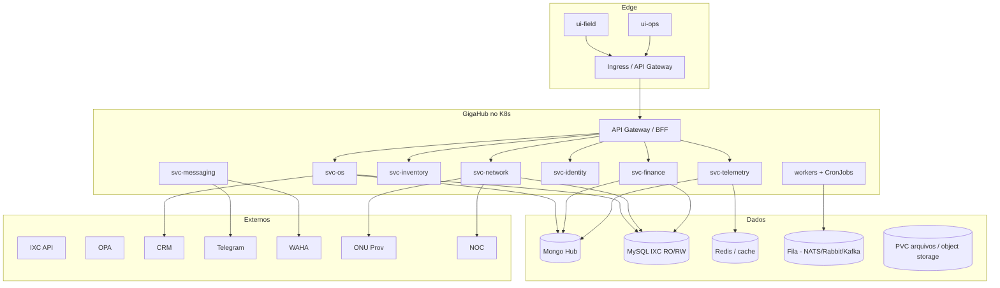

# 06 — Visão GigaHub (unificação modular + Kubernetes)

## Objetivo

O **GigaHub** deve **unificar tudo** que hoje está no GigaCenter (e satélites operacionais) em uma plataforma:

- **Modular** — bounded contexts claros, deployáveis sob demanda  
- **Separada** — processos isolados (API, workers, bots, UIs)  
- **Profissional** — contratos de API versionados, observabilidade, CI/CD, IaC  
- **Orquestrada por Kubernetes** — scaling, health, secrets, jobs, ingress  

Este documento **não** é o desenho final fechado: é a ponte entre o inventário atual (`docs/01`–`05`) e a arquitetura-alvo.

---

## Princípios de unificação

1. **Domínio primeiro, canal depois** — OS, Estoque, Financeiro, Rede, Mensageria são módulos; Telegram/Web/MCP são adapters.
2. **IXC continua ERP** — GigaHub orquestra; não reimplementa billing/contratos do zero sem necessidade.
3. **Um contrato de use-case** — HTTP, bot e agents consomem a mesma aplicação de serviço (já iniciado nos use-cases Nest).
4. **Workers fora da API** — crons e WAHA não competem com request/response no mesmo processo.
5. **Config e secrets externos** — ConfigMaps/Secrets; zero credencial em imagem.
6. **Observabilidade padrão** — logs estruturados, métricas, tracing, alertas por domínio.

---

## Mapa: monólito atual → módulos GigaHub

| Bounded context (sugerido) | O que absorve do GigaCenter | Depêndencias críticas |
|----------------------------|-----------------------------|------------------------|
| **Identity & Access** | Auth JWT, funcionários, cargos, permissoes, MCP OAuth | Mongo app, sync IXC users |
| **Field Work (OS)** | Agenda, deslocamento, execução, revisão, arquivos, assuntos | IXC OS, CRM, GPS policy |
| **Network (CTO/ONU)** | CTO, sinais, PDF relatório, provisionamento ONU | NOC, NetPulse, ONU host, IXC fibra |
| **Inventory** | Almoxarifado, requisição, transferência, comodato OS | IXC produtos |
| **Finance Ops** | Fechamento, transferência, recebimento, vistoria, depreciação | Mongo financeiro + IXC fn_* |
| **Customer Care** | Cliente lookup, suporte, OPA sync, tickets | IXC cliente, OPA, CRM |
| **Messaging** | Telegram bot, WAHA WhatsApp, alertas | Telegram API, WAHA |
| **Telemetry** | GPS ingest, Socket.IO stream, rastreador, métricas | Mongo localizações |
| **Automation / Jobs** | Todas as routines atuais | Tudo acima (como cliente) |
| **Experience** | `ui-external`, `ui-internal` (futuro shell único opcional) | APIs dos módulos |

> “Unificar TUDO” ≠ um único container. Significa **um produto/plataforma** com módulos coesos, repositório(s) e governança únicos.

---

## Arquitetura-alvo (referência)

### Workloads K8s sugeridos

| Workload | Tipo | Notas |
|----------|------|-------|
| `gigahub-api` ou serviços por domínio | Deployment | Começar fatiando workers; APIs podem nascer do monólito modular |
| `gigahub-telegram` | Deployment | Bot isolado; escala 1 (ou sticky) por webhook |
| `gigahub-waha-worker` | Deployment | Consome fila de mensagens |
| `gigahub-onu-worker` | CronJob / Deployment | Substitui cron */1 |
| `gigahub-sync-*` | CronJobs | Users, fibra, OPA names, financeiro notify |
| `gigahub-pdf` | Deployment | Chromium separado |
| `ui-field` / `ui-ops` | Deployment + Ingress | Nginx/static |
| Redis / fila | Helm chart / operator | Cache e desacoplamento |
| Mongo | Operator ou managed | App DB |
| PVC / S3 | Storage | Arquivos IXC e PDFs |

---

## Estratégia de migração (incremental)

### Fase 0 — Congelar o conhecimento
- Manter `docs/` atualizados (este pacote)
- Inventário de rotinas, env vars e endpoints (já em `05`)

### Fase 1 — Modularizar o monólito (ainda 1 deploy)
- Pacotes/Nx libs por domínio: `os`, `network`, `inventory`, `finance`, `messaging`, `identity`
- Fronteiras internas com APIs claras (mesmo processo Nest com módulos)
- Extrair interfaces de adapters (IXC, CRM, WAHA)

### Fase 2 — Extrair workers
- WAHA sender → worker + fila  
- ONU provisioning / desvinculada → CronJobs  
- Sync users/fibra/OPA → CronJobs  
- PDF → serviço dedicado  

### Fase 3 — Extrair serviços de domínio
- Começar por **Telemetry** (GPS) ou **Finance** (menos acoplado ao ciclo OS completo)  
- Em seguida **Messaging** (Telegram)  
- Por último fatiar **OS** (maior acoplamento)

### Fase 4 — Plataforma K8s
- Cluster (on-prem ou cloud), Ingress, cert-manager, ExternalSecrets  
- Ambientes: `dev` / `staging` / `prod`  
- GitOps (Argo CD / Flux) alinhado ao espírito GitOps do ecossistema Harness/Argo  

### Fase 5 — Experiência unificada
- Shell GigaHub com módulos feature-flagged (campo + ops)
- Deprecar caminhos legados `/api/services` após paridade
- MCP como gateway de tools sobre os mesmos serviços

---

## Contratos que o GigaHub deve preservar

Do comportamento atual (ver `03`):

| Contrato de negócio | Motivo |
|---------------------|--------|
| Status OS `AG → DS → EX` + finalização via CRM | Fluxo operacional já treinado |
| Assuntos como motor de compliance | Fotos/perguntas/validações/NOC |
| Geofence 300 m + GPS fresco | Qualidade e antifraude operacional |
| Lacre / fechamento / transferência / recebimento / vistoria | Cadeia financeira |
| Autorização ONU automatizada | Escala de instalação FTTH |
| Paridade Telegram ↔ App | Adoção gradual sem regressão |

---

## Estrutura de repositório sugerida (alvo)

Opções válidas:

**A — Monorepo GigaHub (recomendado no início)**  
Continuidade Nx: `apps/*` + `libs/domain-*` + `libs/adapters-*` + `deploy/k8s`.

**B — Multi-repo por domínio**  
Só após times e contratos estáveis (OpenAPI + versionamento semântico).

Sugestão pragmática: **A até a Fase 3**, depois extrair só o que precisar de ciclo de vida independente.

---

## Riscos a endereçar cedo

| Risco atual | Mitigação no GigaHub |
|-------------|----------------------|
| Processo único (API+bot+cron) | Separar Deployments/CronJobs |
| Cache só Mongo | Redis para hot path (GPS, sessões) |
| Sem fila | Introduzir broker para WhatsApp e jobs |
| Arquivos em path de rede | PVC/NFS ou object storage + adapter |
| Senhas em claro no login | Hash + migração de credenciais |
| Sem CI no repo | Pipeline build/test/scan/deploy |
| Acoplamento forte ao IXC | Anti-corruption layer por domínio |

---

## Definition of Done (GigaHub v1)

Uma “v1” profissional pode significar:

- [ ] Domínios em libs/módulos com borders testáveis  
- [ ] API + Telegram + UIs apontando para os mesmos serviços de domínio  
- [ ] Workers e CronJobs no K8s (ONU, WAHA, syncs)  
- [ ] Secrets externos, health/readiness, HPA onde fizer sentido  
- [ ] OpenAPI publicado e Swagger por serviço  
- [ ] Ambientes staging ≈ prod  
- [ ] Docs de domínio atualizadas (esta pasta evoluída para `docs/domains/*`)  

---

## Relação com a documentação existente

| Doc | Uso no GigaHub |
|-----|----------------|
| `01` Visão geral | Briefing de produto |
| `02` Arquitetura | As-is técnico |
| `03` Lógicas de negócio | Spec de domínio a preservar |
| `04` Canais | Matriz de adapters / UX |
| `05` Integrações | Inventário de adapters e jobs |
| `06` Este arquivo | To-be e roadmap |

Quando o repositório GigaHub nascer, copie/evolua estes arquivos como **ADRs + domain briefs**, e registre decisões novas em `docs/adr/`.
